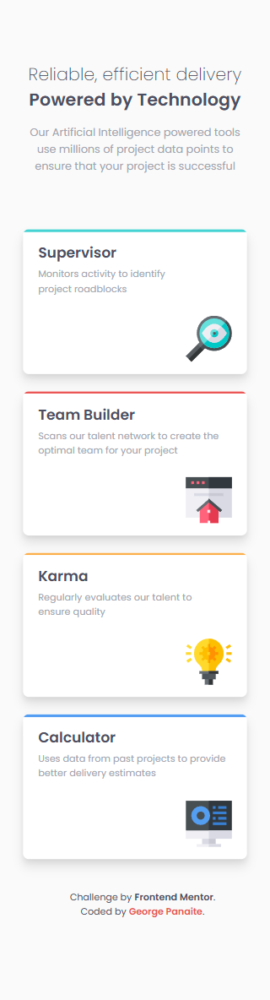
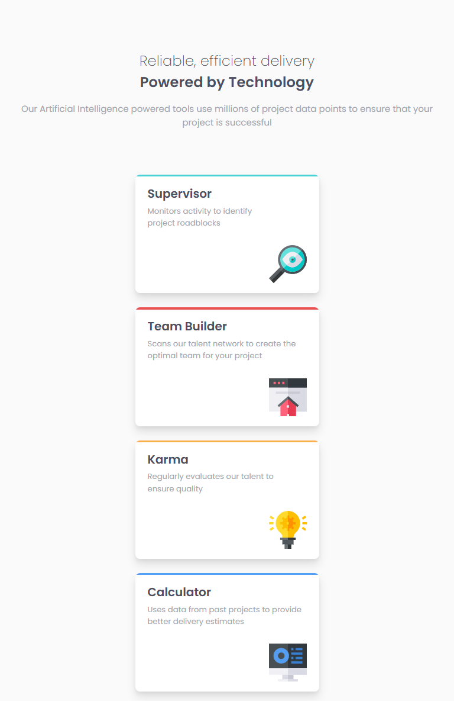
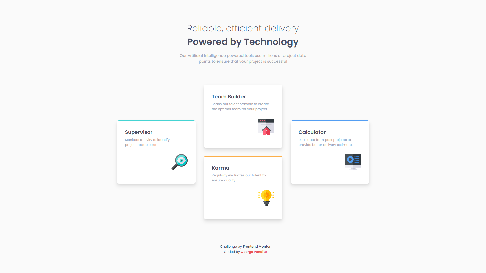
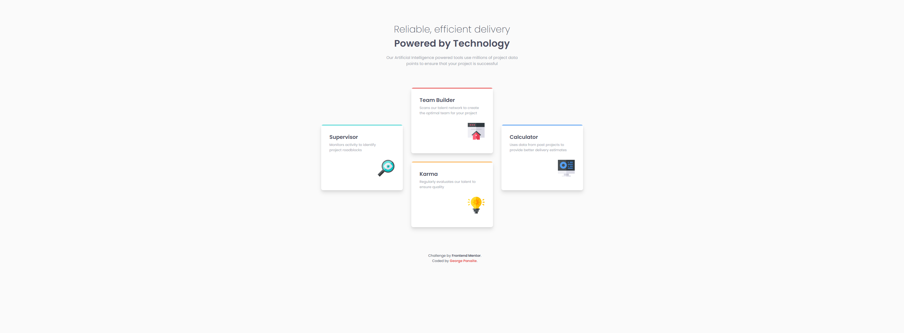

# Frontend Mentor - Four card feature section solution

This is a solution to the [Four card feature section challenge on Frontend Mentor](https://www.frontendmentor.io/challenges/four-card-feature-section-weK1eFYK). Frontend Mentor challenges help you improve your coding skills by building realistic projects. 

## Table of contents

- [Frontend Mentor - Four card feature section solution](#frontend-mentor---four-card-feature-section-solution)
  - [Table of contents](#table-of-contents)
  - [Overview](#overview)
    - [The challenge](#the-challenge)
    - [Screenshots](#screenshots)
    - [Links](#links)
  - [My process](#my-process)
    - [Built with](#built-with)
    - [What I learned](#what-i-learned)
  - [Author](#author)

**Note: Delete this note and update the table of contents based on what sections you keep.**

## Overview

### The challenge

Users should be able to:

- View the optimal layout for the site depending on their device's screen size

### Screenshots
Mobile

Tablet

Desktop

Ultrawide

### Links

- Solution URL: (https://github.com/lynx232/Four-card-feature-section)
- Live Site URL: (https://gp-four-card-feature-section.netlify.app)

## My process

### Built with

- Semantic HTML5 markup
- CSS custom properties
- Flexbox
- CSS Grid
- Mobile-first workflow
- CSS Box Shadows (https://box-shadow.dev/)

### What I learned

I learned how to make use of CSS grid in order to arange the title cards so that they are displayed in a cross pattern.

## Author

- Website - [George Panaite](https://www.your-site.com)
- Frontend Mentor - [@lynx232](https://www.frontendmentor.io/profile/lynx232)
